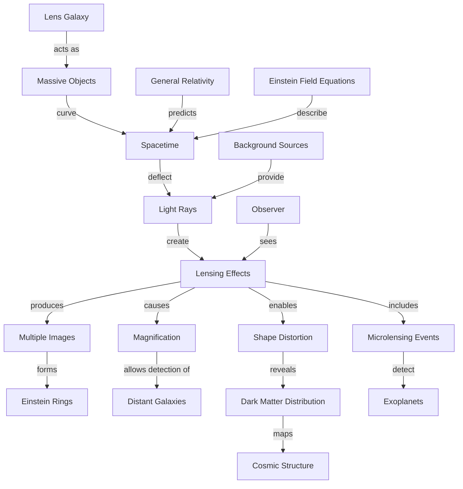

```mermaid
graph TD
    A[Massive Objects] -->|curve| B[Spacetime]
    B -->|deflect| C[Light Rays]
    C -->|create| D[Lensing Effects]
    E[General Relativity] -->|predicts| B
    F[Einstein Field Equations] -->|describe| B
    D -->|produces| G[Multiple Images]
    D -->|causes| H[Magnification]
    D -->|enables| I[Shape Distortion]
    G -->|forms| J[Einstein Rings]
    H -->|allows detection of| K[Distant Galaxies]
    I -->|reveals| L[Dark Matter Distribution]
    M[Background Sources] -->|provide| C
    N[Lens Galaxy] -->|acts as| A
    O[Observer] -->|sees| D
    L -->|maps| P[Cosmic Structure]
    Q[Microlensing Events] -->|detect| R[Exoplanets]
    D -->|includes| Q
```