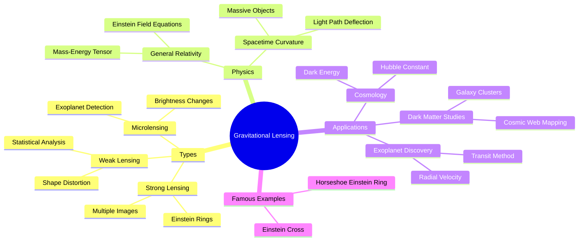

```mermaid
mindmap
    root((Gravitational Lensing))
        Types
            Strong Lensing
                Einstein Rings
                Multiple Images
            Weak Lensing
                Shape Distortion
                Statistical Analysis
            Microlensing
                Brightness Changes
                Exoplanet Detection
        Physics
            General Relativity
                Mass-Energy Tensor
                Einstein Field Equations
            Spacetime Curvature
                Massive Objects
                Light Path Deflection
        Applications
            Dark Matter Studies
                Galaxy Clusters
                Cosmic Web Mapping
            Cosmology
                Hubble Constant
                Dark Energy
            Exoplanet Discovery
                Transit Method
                Radial Velocity
        Famous Examples
            Einstein Cross
            Horseshoe Einstein Ring
```